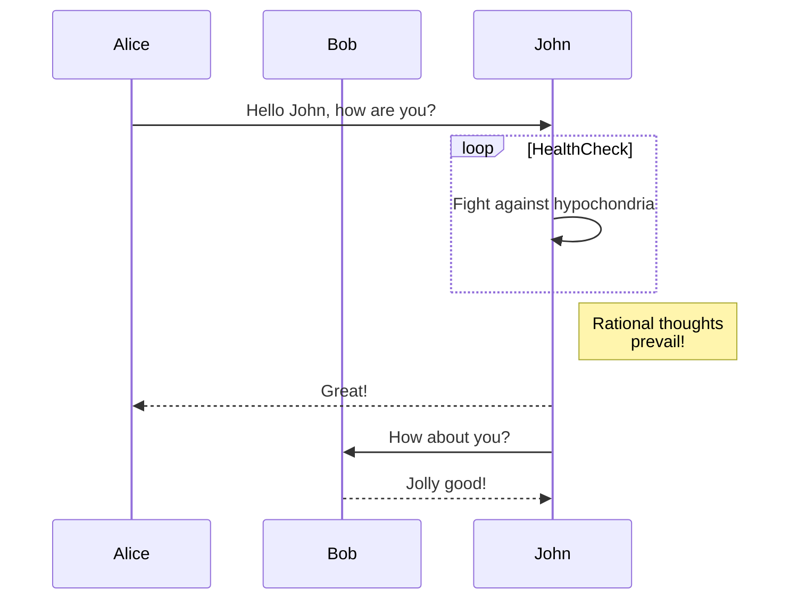

# Slide 1

Content of my slide
text

<div class="absolute bottom-5 left-10">
  <span class="font-size-2">
    {{ $slidev.configs.title }}
  </span>
</div>
<!--
This is a note for my slide and I am typing here
-->

---
layout: center
class: text-white
transition: slide-left
---

# Slide 2

***

A page with the layout `center` and a background image

---

# Slide 2

Content of the second slide

```python {all|1|3-11|3}
import time

def long_process_task():
  """
  内部で8秒間待機することで、処理に時間がかかるように見せる関数。
  """
  print("▶️ 処理を開始します。")
  # この行で8秒間、処理を停止します
  time.sleep(8)
  print("✅ 処理が完了しました！")
# 関数の実行
long_process_task()
```

<style>
h1 {
  color: white
}
</style>

---
fonts:
  # 標準テキスト用
  sans: Noto Sans JP
  # UnoCSS で `font-serif` クラスを指定したとき用
  serif: Noto Serif JP
  # コードブロック用
  mono: Fira Code
---
# Slide 2

Content of the second slide

```python {all|1|3-11|3}
import time

def long_process_task():
  """
  内部で8秒間待機することで、処理に時間がかかるように見せる関数。
  """
  print("▶️ 処理を開始します。")
  # この行で8秒間、処理を停止します
  time.sleep(8)
  print("✅ 処理が完了しました！")
# 関数の実行
long_process_task()
```

<style>
h1 {
  color: white
}
</style>
---

# Slide 3

Third sllide

<asterisks>
asterisks
</asterisks>

*asterisks*

**asterisks**

**asterisks and _underscores_**

~~Serect this~~


---

# Slide 4

1. First ordered list item
2. Another Item
   * Unordered sub-list.

* Unordered list can use asterisks
- or minues
+ or pluses

[私のGitHubのslideページ](https://github.com/y-hiroki-radiotech/slides/tree/main)

You can use numbers for reference-style link difinitions [^1]


[^1]: https://github.com/y-hiroki-radiotech/slides/tree/main

---

# Slide Image


<style>
  img {
    margin: auto;
    width: 70%
  }
</style>

---

| Tables | Are | Cool |
|---|:---:|---:|
| col 3 is | right-aligned | $1600 |
| col 2 is | centered | $12 |
| zebra stripes | are neat | $1 |

<br>

> Black quote

---
layout: two-cols
---

## Left

This show on the left side

::right::

## Right

This shows on the right

---

# LaTeX

In line $\sqrt{3x-1} + (1 + x)^2$ and $a=2$

$$b=2$$

$$ \begin{array}{c}

\nabla \times \vec{\mathbf{B}} -, \frac1c, \frac{\partial\vec{\mathbf{E}}}{\partial t} & = \frac{4\pi}{c}\vec{\mathbf{j}} \nabla \cdot \vec{\mathbf{E}} & = 4 \pi \rho \\

\nabla \times \vec{\mathbf{E}}, +, \frac1c, \frac{\partial\vec{\mathbf{B}}}{\partial t} & = \vec{\mathbf{0}} \\

\nabla \cdot \vec{\mathbf{B}} & = 0

\end{array} $$

---
layout: center
---



---
src: ./pages/flowchart.md
---


---

# アニメーション

<v-click>Hello World!</v-click>
<br>
<br>
<v-click>こんにちは、世界！</v-click>
<br>
<div v-click class="text-x1"> Hey! </div>
<br>
<br>
<div v-click> Hello </div>
<div v-after> World! </div>

---

# クリック後に非表示にする

<div v-click>今日は</div>
<div v-click.hide>いい</div>
<div v-after.hide>天気</div>

---

# クリックをまとめて適応

<v-clicks>

- 今日は
- いい
- 天気
- だよね
</v-clicks>

<v-clicks depth="2">

- Item 1
  - Item 1.1
  - Item 1.2
- Item 2
  - Item 2.1
  - Item 2.2
  -
</v-clicks>

---

<div class="slidev-vclick-target slidev-vclick-hidden">Text</div>

---
mdc: true
---

# MDC Syntax

formatterに`mdc: true`を追加することで、MDC Syntaxを使用できます。

This is a [red text]{style="color:red"} :inline-component{prop="value"}


---

# UnoCSSの学習

<h1 class="text-2xl font-bold text-blue-600 op-10"> テキストスタイリング</h1>

- スペーシング
<div class = "p-4 mt-8">パディングとマージン</div>

- 背景とボーダー
<div class="bg-gray-100 dark:bg-gray-800 border rounded-g">背景とボーダー</div>

---

# Flexbox(1次元レイアウト)
<div class="flex items-center justify-center h-full">
<p>中央揃えのテキスト</p>
</div>

---

# Grid(2次元レイアウト)
<div class="grid grid-cols-2 gap-8">
<div>左カラムのコンテンツ
<br>
今日は
</div>
<div>右カラムのコンテンツ</div>
</div>

---

<div class="i-mdi-check-circle text-blue-500" />

<div class="i-mdi-alert-circle text-red-500" />

<div class="i-mdi-github text-4xl" />
<div class="i-mdi-github text-6xl" />
