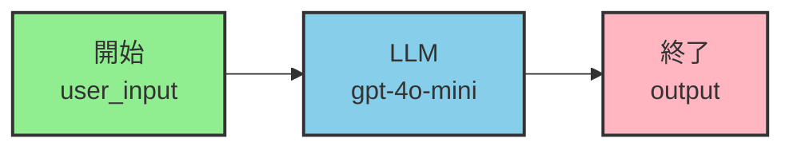
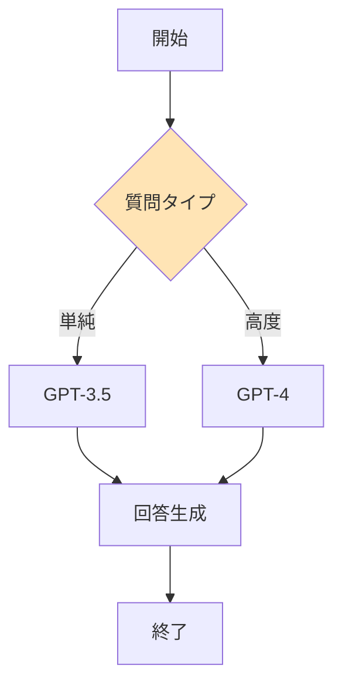
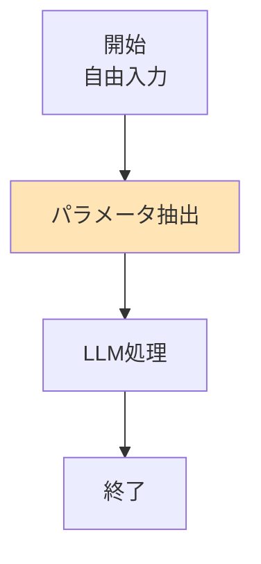

# Difyで学ぶ生成AIアプリ開発

## 第6章 ノードベースのAIアプリケーション構築

<div class="pt-12">
  <span @click="$slidev.nav.next" class="px-2 py-1 rounded cursor-pointer" hover="bg-white bg-opacity-10">
    Press Space for next page <carbon:arrow-right class="inline"/>
  </span>
</div>

<div class="abs-br m-6 flex gap-2">
  <a href="https://github.com/slidevjs/slidev" target="_blank" alt="GitHub"
    class="text-xl slidev-icon-btn opacity-50 !border-none !hover:text-white">
    <carbon-logo-github />
  </a>
</div>

---
layout: intro
---

# 今日学ぶこと

<div class="grid grid-cols-2 gap-4 pt-4">
<div>

## 📚 基礎編
- ノードの基本概念
- 開始・終了ノードの理解
- 変数の埋め込み方法
- LLMノードの活用

</div>
<div>

## 🚀 応用編
- 条件分岐の実装
- 質問分類器の活用
- パラメータ抽出
- CoTの実装方法

</div>
</div>

<style>
.slidev-layout.intro h1 {
  background: linear-gradient(45deg, #4EC5D4 10%, #146b8c 20%);
  -webkit-background-clip: text;
  -webkit-text-fill-color: transparent;
  background-clip: text;
}
</style>

---
transition: fade-out
---

# 6.1 ノードとは何か

<div class="grid grid-cols-2 gap-4">
<div>

## ノード = AIアプリの部品

ブロックのように組み合わせて、AIアプリケーションを作成

### 主要なノード
- 🟢 **開始ノード** - ワークフローのスタート
- 🧠 **LLMノード** - AIの頭脳
- 📚 **知識ノード** - 特別な知識を検索
- 🏁 **終了ノード** - 完成した回答を出力

</div>
<div class="flex items-center justify-center">


</div>
</div>

<arrow v-click="1" x1="400" y1="230" x2="270" y2="230" color="#564" width="3" arrowSize="1" />

<style>
.footnotes-sep {
  @apply mt-20 opacity-10;
}
.footnotes {
  @apply text-sm opacity-75;
}
.footnote-backref {
  display: none;
}
</style>

---
layout: two-cols
---

# 開始・終了ノードの基本

<template v-slot:default>

## 開始ノード
入力を受け取る窓口

### フィールドタイプ
- 📝 **短文** - 1行の入力
- 📄 **段落** - 長文入力
- 🔽 **選択** - ドロップダウン
- 🔢 **数値** - 計算用
- 📎 **ファイル** - アップロード

</template>

<template v-slot:right>

## 終了ノード
結果を出力する場所

### 出力形式
- テキスト形式
- **Markdown形式** ✨
- JSON形式
- 変数の埋め込み

<div class="mt-4 p-4 bg-gray-100 rounded">

```markdown
# 実行結果
{{output}}
```

</div>

</template>

---

# 変数の埋め込み

<div class="grid grid-cols-2 gap-8">
<div>

## 変数の定義
```yaml
変数名: user_input
ラベル名: ユーザーの入力
タイプ: 段落
必須: はい
```

## 複数の入力フィールド
```yaml
- 業界・業種 (industry)
- ターゲット顧客 (target_customer)  
- 予算 (budget)
```

</div>
<div>

## 変数の使い方

<div class="bg-blue-50 p-4 rounded-lg">

### システムプロンプト
```text
あなたは{{industry}}業界の
専門コンサルタントです
```

### ユーザープロンプト
```text
{{target_customer}}向けに
{{budget}}円の予算で
提案をしてください
```

</div>
</div>
</div>

---
class: px-20
---

# Markdown出力の例

<div class="grid grid-cols-2 gap-4">
<div>

## 入力例
```markdown
# マークダウン形式の表示実験
## マークダウンって何？
整形して出力するための記述言語

## 何がメリットなの？
- 色々ですね
- セクションごとに書ける
- テーブル形式でも書ける
- 画像もいける
```

</div>
<div>

## 出力結果

### マークダウン形式の表示実験
#### マークダウンって何？
整形して出力するための記述言語

#### 何がメリットなの？
- 色々ですね
- セクションごとに書ける
- テーブル形式でも書ける
- 画像もいける

</div>
</div>

---

# より実践的なMarkdown例

<div class="text-sm">

````markdown
## ワークフローの基本構造


| 設定項目 | 説明 | 例 |
|---------|------|-----|
| フィールドタイプ | 入力データの種類 | テキスト、段落、数値 |
| 変数名 | システム内での識別子 | user_name, age, query |
| ラベル名 | UI上での表示名 | お名前、年齢、ご質問内容 |

Difyを使いこなしてみませんか！
````

</div>

<div class="mt-8 text-center text-2xl font-bold text-blue-600">
👆 このような表現豊かな出力が可能！
</div>

---
transition: slide-up
level: 2
---

# 6.2 開始→LLM→終了

<div class="flex justify-center mb-8">



</div>

## LLMノードの設定

<div class="grid grid-cols-2 gap-4">
<div>

### 基本設定
- **モデル**: gpt-4o-mini
- **コンテキスト**: 開始/user_input
- **温度**: 0.7（創造性の調整）

</div>
<div>

### プロンプト設定
- **システム**: AIの役割を定義
- **ユーザー**: 具体的な指示
- **変数の埋め込み**: {{変数名}}

</div>
</div>

---

# システムプロンプト vs ユーザープロンプト

<div class="grid grid-cols-2 gap-6">
<div>

## 🎭 システムプロンプト
**AIの役割・ペルソナを設定**

```text
あなたはプロの編集者です。
以下の文章を校正してください。

すべての回答は日本語の
マークダウン形式で、
丁寧な言葉遣いで記述してください。
```

**使用場面**: 一貫した振る舞いが必要な時

</div>
<div>

## 💬 ユーザープロンプト
**具体的なタスクを指示**

```text
このブログ記事のタイトルを
3つ提案してください。

テーマ: {{theme}}
ターゲット: {{target}}
```

**使用場面**: 毎回異なる作業を依頼する時

</div>
</div>

<div class="mt-8 p-4 bg-yellow-50 rounded-lg text-center">
💡 <strong>ポイント</strong>: 使い分けによる精度の差は大きくないが、複雑な指示では役割分担が効果的
</div>

---

# CoT（Chain of Thought）の実装

<div class="text-center mb-6">
<h2 class="text-3xl font-bold bg-gradient-to-r from-blue-600 to-purple-600 text-transparent bg-clip-text">
「独り言」で考え、それを参照しながら回答する
</h2>
</div>

<div class="grid grid-cols-3 gap-4">
<div class="bg-blue-50 p-4 rounded-lg">

### 📝 計画ノード
解法の計画を立てる

```text
問題を分解して
ステップを明確化
```

</div>
<div class="bg-green-50 p-4 rounded-lg">

### 🔍 実行ノード
計画に従って実行

```text
各ステップを
順番に処理
```

</div>
<div class="bg-purple-50 p-4 rounded-lg">

### ✅ 検証ノード
回答を検証する

```text
結果の妥当性を
チェック
```

</div>
</div>

<div class="mt-8 text-center">
<p class="text-xl">💡 <strong>ポイント</strong>: LLMの負担を軽くして、各段階に集中させる</p>
</div>

---
layout: center
class: text-center
---

# 6.3 条件分岐

<div class="text-4xl mb-8">
分岐で賢いワークフローを作る
</div>

<div class="grid grid-cols-2 gap-8 mt-8">
<div class="transform hover:scale-105 transition-transform">
<div class="bg-blue-100 p-8 rounded-lg">
<h2 class="text-2xl mb-4">🔀 IF/ELSEノード</h2>
<p class="text-lg">シンプルだけど強力</p>
<p class="mt-2">明確な条件での分岐</p>
</div>
</div>
<div class="transform hover:scale-105 transition-transform">
<div class="bg-purple-100 p-8 rounded-lg">
<h2 class="text-2xl mb-4">🤖 質問分類器</h2>
<p class="text-lg">AIの判断で賢く振り分け</p>
<p class="mt-2">意図の理解が必要な場合</p>
</div>
</div>
</div>

---

# IF/ELSE vs 質問分類器

<div class="grid grid-cols-2 gap-6">
<div>

## IF/ELSEが適している場合

### 明確な条件
- ✅ 年齢が20歳以上か
- ✅ 残高が1000円以上か
- ✅ 在庫があるか
- ✅ ファイルサイズが10MB以下か

```yaml
条件: budget >= 1000000
True: 高額プラン提案
False: 標準プラン提案
```

</div>
<div>

## 質問分類器が適している場合

### 意図の理解が必要
- 🧠 質問の種類を判断
- 🧠 問い合わせの緊急度
- 🧠 文章の感情を分析
- 🧠 ユーザーの意図を推測

```yaml
カテゴリー:
- 技術的な質問
- 料金に関する質問
- 使い方の質問
- その他
```

</div>
</div>

---

# IF/ELSEの実装例

<div class="flex justify-center mb-4">



</div>

## 実装手順

1. 🎯 ユーザーは質問タイプを選択（単純/高度）
2. 📝 質問を入力
3. 🔍 タイプを判定し、適切なAIモデルを選択
4. 💡 選んだモデルで質問に答える

---

# 質問分類器の実装

<div class="bg-gradient-to-r from-blue-50 to-purple-50 p-6 rounded-lg mb-6">
<h2 class="text-2xl font-bold text-center mb-4">自動で賢く振り分け！</h2>
</div>

<div class="grid grid-cols-2 gap-6">
<div>

## 設定例
```yaml
カテゴリー:
  - 技術サポート
    説明: バグや技術的な問題
    
  - 料金・請求
    説明: 支払いや料金プラン
    
  - 一般的な質問
    説明: 使い方や機能について
```

</div>
<div>

## メリット
- 👤 ユーザーは選択に迷わない
- 🌊 自然な対話の流れ
- 🎯 AIが最適な回答を提供
- ⚡ 処理の自動化

<div class="mt-4 p-4 bg-yellow-100 rounded">
💡 <strong>ポイント</strong>: 
ユーザーは質問を入力するだけ！
</div>

</div>
</div>

---
layout: section
---

# 6.5 パラメータ抽出
## 自然言語から必要な情報を自動で取り出す

---

# パラメータ抽出とは？

<div class="text-center mb-8">
<div class="text-3xl font-bold">
「20代の会社員をターゲットに、予算500万円で飲食店を開業したい」
</div>
</div>

<div class="flex justify-center items-center gap-8">
<div class="text-6xl">
⬇️
</div>
</div>

<div class="grid grid-cols-3 gap-4 mt-8">
<div class="bg-blue-100 p-6 rounded-lg text-center">
<h3 class="text-xl font-bold mb-2">Industry</h3>
<p class="text-2xl">飲食</p>
</div>
<div class="bg-green-100 p-6 rounded-lg text-center">
<h3 class="text-xl font-bold mb-2">Target Customer</h3>
<p class="text-2xl">20代の会社員</p>
</div>
<div class="bg-purple-100 p-6 rounded-lg text-center">
<h3 class="text-xl font-bold mb-2">Budget</h3>
<p class="text-2xl">500万円</p>
</div>
</div>

---

# パラメータ抽出の実装

<div class="grid grid-cols-2 gap-6">
<div>

## 実装の流れ



### 設定項目
- 抽出する変数名を定義
- 各変数の説明を記載
- データ型を指定

</div>
<div>

## 活用例

### 🏪 ビジネス相談
```text
入力: "月商100万円を目指して
      カフェを始めたい"
      
抽出: 
- 事業: カフェ
- 目標: 月商100万円
```

### 📅 予約システム
```text
入力: "来週の火曜日15時に
      3名で予約したい"
      
抽出:
- 日時: 来週火曜15時
- 人数: 3名
```

</div>
</div>

---

# パラメータ抽出の真価

<div class="text-center mb-8">
<h2 class="text-3xl font-bold bg-gradient-to-r from-green-600 to-blue-600 text-transparent bg-clip-text">
他のノードと組み合わせた時に真価を発揮
</h2>
</div>

<div class="grid grid-cols-2 gap-8">
<div class="bg-gradient-to-br from-blue-50 to-blue-100 p-6 rounded-lg">

## 🔄 イテレータとの連携
複数の情報を一度に処理

```text
商品A: 1000円 x 3個
商品B: 2000円 x 2個
商品C: 500円 x 5個
```

各商品情報を自動で分解・処理

</div>
<div class="bg-gradient-to-br from-purple-50 to-purple-100 p-6 rounded-lg">

## 🛠️ ツール群との連携
抽出したパラメータで自動化

```text
顧客名: 山田太郎
メール: yamada@example.com
希望日: 2024/03/15
```

自動でメール送信やカレンダー登録

</div>
</div>

---
layout: center
class: text-center
---

# まとめ

<div class="grid grid-cols-2 gap-8 mt-12">
<div>

## 今日学んだこと ✅

- ノードの基本概念
- 変数の埋め込み方法
- 条件分岐の使い分け
- パラメータ抽出の活用

</div>
<div>

## 次のステップ 🚀

- 実際にDifyで手を動かす
- 複雑なワークフローに挑戦
- 実用的なアプリを作成
- チームでの活用を検討

</div>
</div>

<div class="mt-12 text-2xl font-bold">
🎉 Difyで、誰でも簡単にAIアプリケーションを作れる時代へ！
</div>

---
layout: end
---

# ご清聴ありがとうございました

<div class="text-2xl mt-8">
質問・ディスカッションタイム
</div>

<div class="mt-12">
  <div class="text-lg opacity-80">
    📧 お問い合わせ: your-email@example.com
  </div>
  <div class="text-lg opacity-80 mt-2">
    🌐 Dify公式サイト: https://dify.ai/
  </div>
</div>
