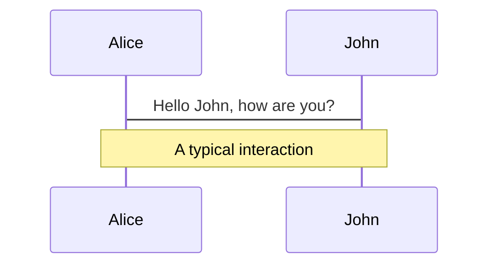
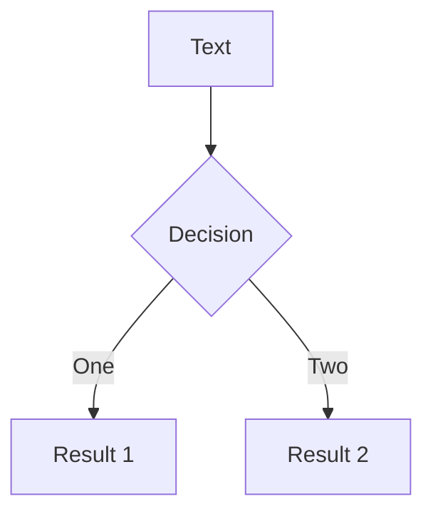
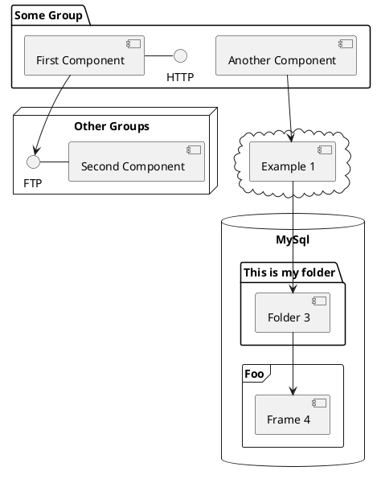

# Slidevへようこそ

開発者向けプレゼンテーションスライド

<!-- インタラクティブな次ページボタン -->
<div @click="$slidev.nav.next" class="mt-12 py-1" hover:bg="white op-10">
  スペースキーで次のページ <carbon:arrow-right />
</div>

<!-- 右下のアクションボタン群 -->
<div class="abs-br m-6 text-xl">
  <button @click="$slidev.nav.openInEditor()" title="エディターで開く" class="slidev-icon-btn">
    <carbon:edit />
  </button>
  <a href="https://github.com/slidevjs/slidev" target="_blank" class="slidev-icon-btn">
    <carbon:logo-github />
  </a>
</div>

<!--
各スライドの最後のコメントブロックはスライドノートとして扱われます。
プレゼンターモードで表示・編集可能です。
-->

---
# フェードアウト遷移を指定
transition: fade-out
---

# Slidevとは？

Slidevは開発者向けに設計されたスライド作成・プレゼンテーションツールです

- 📝 **テキストベース** - Markdownでコンテンツに集中、後からスタイリング
- 🎨 **テーマ対応** - npmパッケージとしてテーマを共有・再利用
- 🧑‍💻 **開発者フレンドリー** - コードハイライト、オートコンプリート付きライブコーディング
- 🤹 **インタラクティブ** - Vueコンポーネントを埋め込んで表現力を向上
- 🎥 **録画機能** - 内蔵録画とカメラビュー
- 📤 **ポータブル** - PDF、PPTX、PNG、またはホスト可能なSPAにエクスポート
- 🛠 **ハック可能** - ウェブページで可能なことはほぼすべてSlidevで実現可能
<br>
<br>

[Why Slidev?](https://sli.dev/guide/why) について詳しくはこちら

<!--
You can have `style` tag in markdown to override the style for the current page.
Learn more: https://sli.dev/features/slide-scope-style
-->

<style>
h1 {
  background-color: #2B90B6;
  background-image: linear-gradient(45deg, #4EC5D4 10%, #146b8c 20%);
  background-size: 100%;
  -webkit-background-clip: text;
  -moz-background-clip: text;
  -webkit-text-fill-color: transparent;
  -moz-text-fill-color: transparent;
}
</style>

<!--
Here is another comment.
-->

---
# スライドアップ遷移、階層レベル2
transition: slide-up
level: 2
---

# ナビゲーション

左下にマウスを重ねるとナビゲーションコントロールパネルが表示されます

## キーボードショートカット

|                                                     |                             |
| --------------------------------------------------- | --------------------------- |
| <kbd>right</kbd> / <kbd>space</kbd>                 | 次のアニメーションまたはスライド     |
| <kbd>left</kbd>  / <kbd>shift</kbd><kbd>space</kbd> | 前のアニメーションまたはスライド |
| <kbd>up</kbd>                                       | 前のスライド              |
| <kbd>down</kbd>                                     | 次のスライド                  |

<!-- クリックアニメーション付きの矢印画像 -->

<p v-after class="absolute bottom-23 left-45 opacity-30 transform -rotate-10">ここをクリック!</p>

---
# 2カラムレイアウト
layout: two-cols
layoutClass: gap-16
---

# 目次

`Toc`コンポーネントを使用してスライドの目次を自動生成できます：

```html
<Toc minDepth="1" maxDepth="1" />
```

タイトルはスライドの内容から推測されますが、フロントマターで`title`と`level`を指定することで上書き可能です。

::right::

<Toc text-sm minDepth="1" maxDepth="2" />

---
# 画像右レイアウト
layout: image-right
image: https://cover.sli.dev
---

# コード

コードスニペットを使用して直接ハイライト表示、型情報のホバー表示も可能！

```ts [filename-example.ts] {all|4|6|6-7|9|all} twoslash
// TwoSlashはMarkdownコードブロック内でTypeScriptの
// ホバー情報とエラーを有効にします
// 詳細: https://shiki.style/packages/twoslash
import { computed, ref } from 'vue'

const count = ref(0)
const doubled = computed(() => count.value * 2)

doubled.value = 2
```

<arrow v-click="[4, 5]" x1="350" y1="310" x2="195" y2="342" color="#953" width="2" arrowSize="1" />

<!-- 外部コードブロックの埋め込み -->
<<< @/snippets/external.ts#snippet

<!-- フッター -->

[Learn more](https://sli.dev/features/line-highlighting)

<!-- インラインスタイル -->
<style>
.footnotes-sep {
  @apply mt-5 opacity-10;
}
.footnotes {
  @apply text-sm opacity-75;
}
.footnote-backref {
  display: none;
}
</style>

<!--
Notes can also sync with clicks

[click] This will be highlighted after the first click

[click] Highlighted with `count = ref(0)`

[click:3] Last click (skip two clicks)
-->

---
level: 2
---

# Shiki Magic Move

[shiki-magic-move](https://shiki-magic-move.netlify.app/)により、
複数のコードスニペット間でアニメーションを実現

複数のコードブロックを追加し、<code>````md magic-move</code>で囲むことで
マジックムーブを有効化：

````md magic-move {lines: true}
```ts {*|2|*}
// step 1
const author = reactive({
  name: 'John Doe',
  books: [
    'Vue 2 - Advanced Guide',
    'Vue 3 - Basic Guide',
    'Vue 4 - The Mystery'
  ]
})
```

```ts {*|1-2|3-4|3-4,8}
// step 2
export default {
  data() {
    return {
      author: {
        name: 'John Doe',
        books: [
          'Vue 2 - Advanced Guide',
          'Vue 3 - Basic Guide',
          'Vue 4 - The Mystery'
        ]
      }
    }
  }
}
```

```ts
// step 3
export default {
  data: () => ({
    author: {
      name: 'John Doe',
      books: [
        'Vue 2 - Advanced Guide',
        'Vue 3 - Basic Guide',
        'Vue 4 - The Mystery'
      ]
    }
  })
}
```

非コードブロックは無視されます。

```vue
<!-- step 4 -->
<script setup>
const author = {
  name: 'John Doe',
  books: [
    'Vue 2 - Advanced Guide',
    'Vue 3 - Basic Guide',
    'Vue 4 - The Mystery'
  ]
}
</script>
```
````

---

# コンポーネント

<div grid="~ cols-2 gap-4">
<div>

スライド内でVueコンポーネントを直接使用できます。

`<Tweet/>`や`<Youtube/>`などの組み込みコンポーネントを提供。
カスタムコンポーネントの追加も簡単です。

```html
<Counter :count="10" />
```

<!-- ./components/Counter.vue -->
<Counter :count="10" m="t-4" />

詳細は [ガイド](https://sli.dev/builtin/components.html) をご覧ください。

</div>
<div>

```html
<Tweet id="1390115482657726468" />
```

<Tweet id="1390115482657726468" scale="0.65" />

</div>
</div>

<!--
Presenter note with **bold**, *italic*, and ~~striked~~ text.

Also, HTML elements are valid:
<div class="flex w-full">
  <span style="flex-grow: 1;">Left content</span>
  <span>Right content</span>
</div>
-->

---
class: px-20
---

# テーマ

Slidevは強力なテーマサポートを提供。テーマはスタイル、レイアウト、
コンポーネント、ツール設定まで提供可能。
フロントマターの**1行編集**でテーマ切り替え：

<div grid="~ cols-2 gap-2" m="t-2">

```yaml
---
theme: default
---
```

```yaml
---
theme: seriph
---
```


</div>

テーマの使用方法については [こちら](https://sli.dev/guide/theme-addon#use-theme) をご覧いただき、
[素晴らしいテーマギャラリー](https://sli.dev/resources/theme-gallery) もチェックしてください。

---

# クリックアニメーション

要素に`v-click`を追加してクリックアニメーションを設定

<div v-click>

クリック時に表示される内容：

```html
<div v-click>クリック時に表示される内容</div>
```

</div>

<br>

<v-click>

<code>v-mark</code> ディレクティブを使用して
インラインマークを追加することも可能です：

```html
<span v-mark.underline.orange>インラインマーカー</span>
```

</v-click>

<div mt-20 v-click>

[アニメーションの詳細](https://sli.dev/guide/animations#click-animation)

</div>

---

# モーション

モーションアニメーションは[@vueuse/motion](https://motion.vueuse.org/)により、
`v-motion`ディレクティブでトリガーされます

```html
<div
  v-motion
  :initial="{ x: -80 }"
  :enter="{ x: 0 }"
  :click-3="{ x: 80 }"
  :leave="{ x: 1000 }"
>
  Slidev
</div>
```

<div class="w-60 relative">
  <div class="relative w-40 h-40">
    
    
    
  </div>

  <div
    class="text-5xl absolute top-14 left-40 text-[#2B90B6] -z-1"
    v-motion
    :initial="{ x: -80, opacity: 0}"
    :enter="{ x: 0, opacity: 1, transition: { delay: 2000, duration: 1000 } }">
    Slidev
  </div>
</div>

<!-- vue script setup scripts can be directly used in markdown, and will only affects current page -->
<script setup lang="ts">
const final = {
  x: 0,
  y: 0,
  rotate: 0,
  scale: 1,
  transition: {
    type: 'spring',
    damping: 10,
    stiffness: 20,
    mass: 2
  }
}
</script>

<div
  v-motion
  :initial="{ x:35, y: 30, opacity: 0}"
  :enter="{ y: 0, opacity: 1, transition: { delay: 3500 } }">

[アニメーションの詳細](https://sli.dev/guide/animations.html#motion)

</div>

---

# LaTeX

LaTeXは標準サポート。[KaTeX](https://katex.org/)により実現。

<div h-3 />

インライン $\sqrt{3x-1}+(1+x)^2$

ブロック
$$ {1|3|all}
\begin{aligned}
\nabla \cdot \vec{E} &= \frac{\rho}{\varepsilon_0} \\
\nabla \cdot \vec{B} &= 0 \\
\nabla \times \vec{E} &= -\frac{\partial\vec{B}}{\partial t} \\
\nabla \times \vec{B} &= \mu_0\vec{J} + \mu_0\varepsilon_0\frac{\partial\vec{E}}{\partial t}
\end{aligned}
$$

[詳細はこちら](https://sli.dev/features/latex)

---

# 図表

テキスト記述から直接Markdown内で図表・グラフを作成可能

```mermaid
mindmap
  root((mindmap))
    Origins
      Long history
      ::icon(fa fa-book)
      Popularisation
        British popular psychology author Tony Buzan
    Research
      On effectiveness<br/>and features
      On Automatic creation
        Uses
            Creative techniques
            Strategic planning
            Argument mapping
    Tools
      Pen and paper
      Mermaid
```

<div class="grid grid-cols-4 gap-5 pt-4 -mb-6">









</div>

[Mermaid Diagrams](https://sli.dev/features/mermaid) と [PlantUML Diagrams](https://sli.dev/features/plantuml) について詳しくはこちら

---
# フロントマター変数とドラッグ位置の保存
foo: bar
dragPos:
  square: 691,32,167,_,-16
---

# ドラッグ可能要素

ドラッグ可能要素をダブルクリックして位置を編集

<br>

###### ディレクティブの使い方

```md

```

<br>

###### コンポーネントの使い方

```md
<v-drag text-3xl>
  <div class="i-carbon:arrow-up" />
  Use the `v-drag` component to have a draggable container!
</v-drag>
```

<v-drag pos="663,206,261,_,-15">
  <div text-center text-3xl border border-main rounded>
    ダブルクリックで編集!
  </div>
</v-drag>


###### ドラッグ可能な矢印

```md
<v-drag-arrow two-way />
```

<v-drag-arrow pos="73,452,253,46" two-way op70 />

---
# 外部スライドファイルのインポート
src: ./pages/imported-slides.md
hide: false
---

---

# Monaco エディター

Slidevは内蔵Monaco エディターサポートを提供

コードブロックに`{monaco}`を追加してエディターに変換：

```ts {monaco}
import { ref } from 'vue'
import { emptyArray } from './external'

const arr = ref(emptyArray(10))
```

`{monaco-run}`を使用して、スライド内で直接コードを実行できるエディターを作成：

```ts {monaco-run}
import { version } from 'vue'
import { emptyArray, sayHello } from './external'

sayHello()
console.log(`vue ${version}`)
console.log(emptyArray<number>(10).reduce(fib => [...fib, fib.at(-1)! + fib.at(-2)!], [1, 1]))
```

---
# センターレイアウト、テキスト中央揃え
layout: center
class: text-center
---

# さらに学ぶ

[ドキュメント](https://sli.dev) · [GitHub](https://github.com/slidevjs/slidev) · [ショーケース](https://sli.dev/resources/showcases)

<PoweredBySlidev mt-10 />
