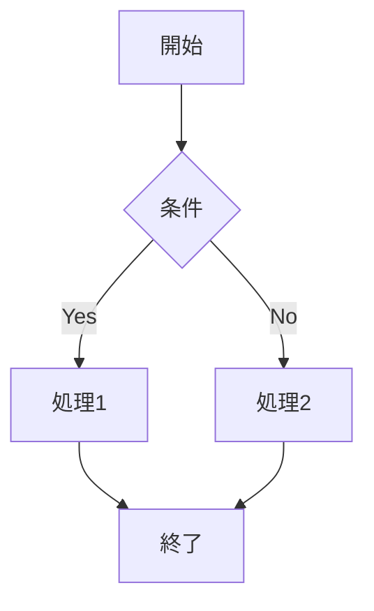
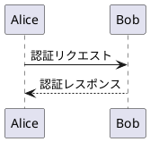

GitHubのslidevjs/slidevリポジトリから、slidevのスライド作成方法について調査します。以下がSlidevのスライド作成の主要なコマンドと機能をまとめたものです：

## 基本コマンド

### プロジェクトの作成・開始
| コマンド | 機能 |
|--------|------|
| `npm create slidev` | 新しいSlidevプロジェクトを作成 |
| `slidev` | 開発サーバーを起動（デフォルトでslides.mdを使用） |
| `slidev [entry]` | 指定したmarkdownファイルで開発サーバーを起動 |

### ビルド・エクスポート
| コマンド | 機能 |
|--------|------|
| `slidev build` | 静的サイトとしてビルド |
| `slidev export` | PDF/PNG/PPTX/Markdown形式でエクスポート |
| `slidev export-notes` | プレゼンターノートをPDFでエクスポート |

### その他のコマンド
| コマンド | 機能 |
|--------|------|
| `slidev format` | Markdownファイルをフォーマット |
| `slidev theme eject` | 現在のテーマをローカルにコピー |

## Markdown記法

### スライド構造
| 記法 | 機能 |
|------|------|
| `---` | スライド区切り |
| フロントマター（YAML） | スライドごとの設定 |
| `<!-- notes -->` | プレゼンターノート |

### コンテンツ記法
| 記法 | 機能 |
|------|------|
| ` ```ts {monaco} ` | Monacoエディタ（インタラクティブコード） |
| ` ```ts {1-3\|4-6} ` | コードブロックのハイライト |
| ` ````md magic-move ` | コードアニメーション |
| `$...$` | インライン数式（LaTeX） |
| `$$...$$` | ブロック数式 |
| ` ```mermaid ` | Mermaidダイアグラム |

## Vueコンポーネント

### アニメーション
| コンポーネント/ディレクティブ | 機能 |
|---------------------------|------|
| `<v-click>` | クリックで表示 |
| `<v-after>` | 前の要素の後に表示 |
| `<v-clicks>` | 子要素を順番に表示 |
| `v-click` ディレクティブ | 要素にクリックアニメーションを適用 |
| `v-motion` | モーションアニメーション |

### その他のコンポーネント
| コンポーネント | 機能 |
|-------------|------|
| `<Tweet>` | ツイートの埋め込み |
| `<Youtube>` | YouTube動画の埋め込み |
| `<Toc>` | 目次の生成 |
| `<Transform>` | 要素の変形・拡大縮小 |
| `<Arrow>` | 矢印の描画 |

## フロントマター設定

### グローバル設定（ヘッドマター）
| 設定 | 機能 |
|-----|------|
| `theme` | テーマの指定 |
| `title` | プレゼンテーションのタイトル |
| `highlighter` | コードハイライター（shiki/prism） |
| `colorSchema` | カラースキーム（light/dark/auto） |
| `fonts` | フォント設定 |
| `monaco` | Monacoエディタの有効化 |

### スライドごとの設定（フロントマター）
| 設定 | 機能 |
|-----|------|
| `layout` | レイアウト（default/cover/center等） |
| `transition` | スライド遷移効果 |
| `background` | 背景画像/色 |
| `class` | CSSクラス |
| `clicks` | クリック数の指定 |
| `src` | 外部スライドのインポート |

## キーボードショートカット

### ナビゲーション
| キー | 機能 |
|-----|------|
| `Space` / `→` | 次へ |
| `Shift+Space` / `←` | 前へ |
| `↓` | 次のスライド |
| `↑` | 前のスライド |
| `g` | スライド番号でジャンプ |

### 表示モード
| キー | 機能 |
|-----|------|
| `o` | オーバービューモード |
| `d` | ダークモード切り替え |
| `f` | フルスクリーン |
| `p` | 描画モード |

## CLI オプション

### 開発サーバー
| オプション | 機能 |
|----------|------|
| `--port, -p` | ポート番号 |
| `--open, -o` | ブラウザを自動で開く |
| `--remote` | リモートアクセスを有効化 |
| `--tunnel` | Cloudflareトンネル |

### エクスポート
| オプション | 機能 |
|----------|------|
| `--format` | 出力形式（pdf/png/pptx/md） |
| `--output` | 出力ファイル名 |
| `--range` | ページ範囲指定 |
| `--with-clicks` | クリックアニメーションを含める |
| `--dark` | ダークテーマで出力 |


Slidevのスライド作成で使える詳細な機能を以下にまとめます：

## レイアウトシステム

### 組み込みレイアウト
| レイアウト | 用途 | 特徴 |
|-----------|------|------|
| `default` | 標準レイアウト | 基本的なスライド |
| `cover` | 表紙スライド | タイトル・サブタイトル中央配置 |
| `center` | 中央寄せ | コンテンツを中央に配置 |
| `two-cols` | 2カラム | 左右分割レイアウト |
| `two-cols-header` | ヘッダー付き2カラム | タイトル + 左右分割 |
| `image` | 画像レイアウト | 画像を主体としたレイアウト |
| `image-left` | 左画像レイアウト | 左に画像、右にテキスト |
| `image-right` | 右画像レイアウト | 右に画像、左にテキスト |
| `iframe` | iframe埋め込み | 外部コンテンツの埋め込み |
| `intro` | 自己紹介 | 発表者情報の表示 |
| `quote` | 引用 | 引用文の表示 |
| `section` | セクション区切り | 章の区切りページ |
| `statement` | 宣言・主張 | 大きなテキストで主張を表示 |
| `fact` | 事実・統計 | 数値や事実の強調表示 |
| `full` | フルスクリーン | 余白なしの全画面表示 |

### スロット記法
```markdown
---
layout: two-cols
---

# メインコンテンツ

デフォルトスロットの内容

::right::
右カラムの内容

::left::
左カラムの内容（two-colsレイアウトで使用）
```

## 高度なコード機能

### Monacoエディタオプション
```markdown
```ts {monaco} {height:'400px'} {editorOptions:{lineNumbers:'on'}}
// 高さとエディタオプションを指定
const message = 'Hello'
```
```

| オプション | 説明 |
|-----------|------|
| `{monaco}` | Monacoエディタを有効化 |
| `{monaco-run}` | 実行可能なコード |
| `{monaco-diff}` | 差分表示モード |
| `height` | エディタの高さ |
| `readonly` | 読み取り専用 |
| `lineNumbers` | 行番号表示 |

### コードスニペット読み込み
```markdown
<<< @/snippets/example.ts
<<< @/snippets/example.ts#L5-L10
<<< @/snippets/example.ts {2,4-5}
```

### Shiki Magic Move
````markdown
````md magic-move {lines: true}
```js
// ステップ1
const count = ref(0)
```

```js
// ステップ2
const count = ref(0)
const doubled = computed(() => count.value * 2)
```

```ts
// ステップ3: 言語も変更可能
const count: Ref<number> = ref(0)
const doubled = computed(() => count.value * 2)
```
````
````

## スタイリング機能

### インラインスタイル
```markdown
<style>
h1 {
  background: linear-gradient(45deg, #4EC5D4 10%, #146b8c 20%);
  -webkit-background-clip: text;
  -webkit-text-fill-color: transparent;
}
</style>
```

### UnoCSS統合
```markdown
<div class="grid grid-cols-2 gap-4">
  <div class="bg-blue-500 p-4 rounded">
    Tailwind風のユーティリティクラス
  </div>
</div>
```

### CSS変数
| 変数名 | 用途 |
|--------|------|
| `--slidev-theme-primary` | プライマリカラー |
| `--slidev-code-background` | コード背景色 |
| `--slidev-code-foreground` | コード文字色 |
| `--slidev-layout-gap` | レイアウト間隔 |

## アニメーション詳細

### v-click高度な使い方
```markdown
<!-- 特定のタイミングで表示 -->
<div v-click="3">3番目のクリックで表示</div>

<!-- 範囲指定 -->
<div v-click="[2, 4]">2-4番目のクリックで表示</div>

<!-- 相対位置 -->
<div v-click="+2">前の要素の2クリック後</div>

<!-- フェード効果 -->
<div v-click.fade>フェードイン</div>

<!-- 非表示にする -->
<div v-click-hide="3">3番目のクリックで非表示</div>
```

### v-motion詳細
```markdown
<div
  v-motion
  :initial="{ x: -80, opacity: 0 }"
  :enter="{ x: 0, opacity: 1 }"
  :click-1="{ x: 20, scale: 1.2 }"
  :click-2="{ y: 20, rotate: 45 }"
  :leave="{ opacity: 0 }"
>
  複雑なアニメーション
</div>
```

## ダイアグラム機能

### Mermaid
```markdown

```

### PlantUML
```markdown

```

### Draw.io統合
```markdown
<iframe src="https://embed.diagrams.net/?embed=1&ui=atlas&spin=1&modified=unsavedChanges&proto=json" />
```

## メディア埋め込み

### ビデオ
```markdown
<SlidevVideo controls autoplay>
  <source src="/demo.mov" type="video/mp4">
</SlidevVideo>

<!-- 自動再生オプション -->
<SlidevVideo autoplay :loop="true" :muted="true">
  <source src="/background.mp4">
</SlidevVideo>
```

### オーディオ
```markdown
<audio controls>
  <source src="/demo.mp3" type="audio/mpeg">
</audio>
```

### iframe埋め込み
```markdown
---
layout: iframe
url: https://example.com
---
```

## プレゼンター機能

### プレゼンターノート
```markdown
# スライドタイトル

メインコンテンツ

<!--
プレゼンターノート：
- ポイント1
- ポイント2
- 時間配分に注意
-->
```

### プレゼンタービュー機能
- 現在のスライドと次のスライド表示
- 経過時間タイマー
- ノート表示
- クリック位置インジケーター

## 描画・注釈機能

### 描画ツール
| ツール | ショートカット | 機能 |
|--------|---------------|------|
| ペン | `p` | フリーハンド描画 |
| 直線 | - | 直線描画 |
| 矢印 | - | 矢印描画 |
| 四角形 | - | 四角形描画 |
| 円 | - | 円描画 |
| 消しゴム | - | 描画を消去 |

### 描画設定
```yaml
---
drawings:
  enabled: true
  persist: true  # 描画を保存
  presenterOnly: false  # 全員が描画可能
  syncAll: true  # 描画を同期
---
```

## データ可視化

### Chart.js統合
```markdown
<Bar :data="chartData" :options="chartOptions" />

<script setup>
const chartData = {
  labels: ['1月', '2月', '3月'],
  datasets: [{
    label: '売上',
    data: [12, 19, 3]
  }]
}
</script>
```

### 目次（TOC）
```markdown
<Toc />
<Toc :columns="2" :maxDepth="2" :mode="'all'" />
```

## 拡張機能

### カスタムセットアップ
```typescript
// setup/main.ts
export default defineAppSetup(({ app, router }) => {
  // Vueアプリケーションの設定
  app.use(MyPlugin)
})
```

### カスタムショートカット
```typescript
// setup/shortcuts.ts
export default defineShortcutsSetup((nav, shortcuts) => {
  return [
    ...shortcuts,
    {
      key: 'ctrl+s',
      fn: () => console.log('保存'),
      autoRepeat: false
    }
  ]
})
```

### プリパーサー拡張
```typescript
// setup/preparser.ts
export default definePreparserSetup(() => {
  return [
    {
      transformRawLines(lines) {
        // 行の変換処理
      }
    }
  ]
})
```

## リモート機能

### リモートアクセス
```bash
slidev --remote [password]
# QRコード表示: cキー
```

### 同期機能
- プレゼンター/ビューアー同期
- リアルタイム描画同期
- クリック位置同期

## 録画機能

### 録画設定
```yaml
---
record: true
---
```

### 録画オプション
- 画面録画
- カメラ録画（別ファイル）
- 解像度: 720p/1080p/1440p/2160p
- フレームレート: 15/24/30/60 fps

## SEO・メタデータ

### Open Graph設定
```yaml
---
seoMeta:
  title: 'プレゼンタイトル'
  description: '説明'
  author: '著者名'
  keywords: 'slidev,presentation'
  ogImage: '/og-image.png'
---
```

## アクセシビリティ

### スライド選択可能性
```yaml
---
selectable: true  # テキスト選択を有効化
---
```

### アクセシビリティ機能
- キーボードナビゲーション完全対応
- スクリーンリーダー対応
- 高コントラストモード対応

## 印刷・エクスポート詳細

### PDFオプション
```bash
slidev export --with-toc --per-slide --with-clicks
```

### 印刷用CSS
```css
@media print {
  .slidev-presenter-note {
    display: none;
  }
}
```

これらの機能を組み合わせることで、高度でインタラクティブなプレゼンテーションを作成できます。
